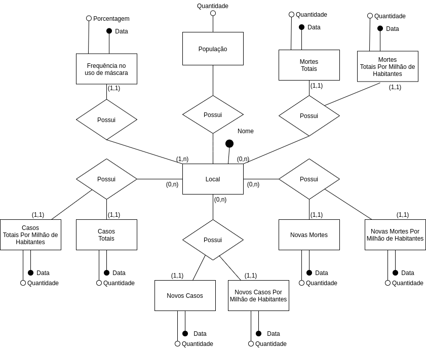
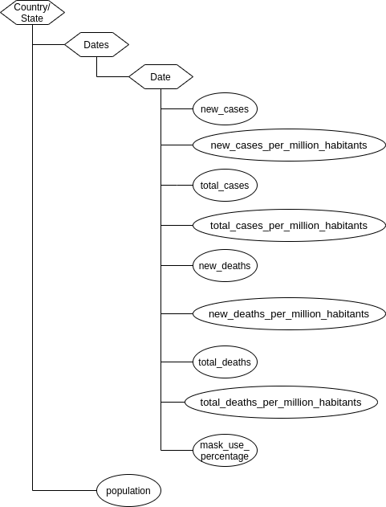

# Projeto COVID-19: Integração de Dados Internacionais para Análise da Pandemia

# Equipe Coviders - CVDRS
* `Fernando dos Reis Santos Filho` - `234471`
* `Renan Hiroki Bastos` - `176573`
* `Vinicius Alves Mancine Dantas` - `188092`

## Resumo do Projeto
O final do ano de 2019 foi marcado pelo surgimento do vírus Sars-CoV-2, responsável pela doença Covid-19 e por uma intensa pandemia com consequências socioeconômicas e sanitárias gravíssimas, graças à sua alta taxa de transmissão. Hoje, quase dois anos depois, grandes bases de dados foram e ainda são construídas ao redor do mundo catalogando os milhões de casos e mortes confirmados por Covid-19 todos os dias.

Durante todo o período de pandemia, recomendações sobre lavar as mãos, evitar aglomeração e utilizar máscara foram fortemente disseminadas. Porém, ao redor do mundo tivemos inúmeros casos de resistência ao uso de máscara, atitude que contribuiu com a alta taxa de transmissão do vírus. Com isso, algumas dúvidas surgiram a respeito de quanto o uso da máscara influencia na disseminação do vírus e se lugares onde o uso de máscara não foi frequente apresentam maiores números de contaminados e mortos por Covid-19.

Logo, nosso objetivo com esse trabalho é extrair, tratar e compilar dados  de fontes distintas relacionados à Covid-19 e a sua prevenção através do uso de máscaras em um único dataset público. Assim, será possível fazer análises sobre a pandemia, a adoção e a eficácia deste método de prevenção em um contexto global através de um único dataset.
## Slides da Apresentação
[slides apresentação](slides/MC536-TrabalhoFinal.pdf)
## Modelo Conceitual Preliminar

> 
## Modelos Lógicos
### Modelo Relacional 
~~~
CASOS(_id_, location, date, new_cases, total_cases, new_deaths, total_deaths, mask_use_percentage, new_cases_per_million_habitants, new_deaths_per_million_habitants, total_cases_per_million_habitants, total_deaths_per_million_habitants, population)
  location chave estrangeira -> POPULACAO(location)

POPULACAO(location,  population)
~~~

### Modelo Hierárquico 
> 

## Dataset Publicado

título do arquivo/base | link | breve descrição
----- | ----- | -----
nyt.csv | [raw](data/raw/nyt.csv) | Dados sobre uso de máscara, quantidades de casos e quantidade de mortes por Covid-19 nos Estados Unidos, dividido por estados e cidades.
owid-covid-data.csv | [raw](data/raw/owid-covid-data.csv) | Dados sobre quantidade de casos e quantidade de mortes por Covid-19 em 196 países, além de informações sobre vacinação, testes e hospitais em cerca de 200 países.
plosone.csv | [raw](data/raw/plosone.csv) | Dados sobre o uso de máscaras, quantidade de casos e quantidade de mortes de Covid-19 em 22 estados dos Estados Unidos.
yougov-chart.csv | [raw](data/raw/yougov-chart.csv) | Dados sobre a porcentagem de uso de máscaras em lugares públicos em 23 países em diferentes regiões do mundo.
dados_nyt_tratados.csv  | [interim](data/interim/dados_nyt_tratados.csv) | Dados sobre uso de máscara, quantidades de casos e quantidade de mortes por Covid-19 nos Estados Unidos, dividido por estados e cidades.
dados_owid_tratados.csv | [interim](data/interim/dados_owid_tratados.csv) | Dados sobre quantidade de casos e quantidade de mortes por Covid-19 em 196 países, além de informações sobre vacinação, testes e hospitais em cerca de 200 países.
dados_plosone_tratados.csv | [interim](data/interim/dados_plosone_tratados.csv) | Dados sobre o uso de máscaras, quantidade de casos e quantidade de mortes de Covid-19 em 22 estados dos Estados Unidos.
eua_final.csv | [interim](data/interim/eua_final.csv) | Dados sobre o uso de máscaras, quantidade de casos e quantidade de mortes de Covid-19 em 22 estados dos Estados Unidos.
europa_final.csv | [interim](data/interim/europa_final.csv) | Dados sobre o uso de máscaras, quantidade de casos e quantidade de mortes de Covid-19 em 22 estados da Europa.
yougov-tratada.csv | [external](data/external/yougov-tratada.csv) | Dados sobre a porcentagem de uso de máscaras em lugares públicos em 23 países em diferentes regiões do mundo.
casos.csv | [processed](data/processed/casos.csv) | Dataset finalizado.
casos.json | [processed](data/processed/casos.json) | Dataset finalizado em JSON.
populacao.csv | [processed](data/processed/populacao.csv) | Dados sobre a quantidade populacional para cada localização.

## Bases de Dados

título da base | link | breve descrição
----- | ----- | -----
Coronavirus (Covid-19) Data in the United States | https://github.com/nytimes/covid-19-data | Dados sobre uso de máscara, quantidades de casos e quantidade de mortes por Covid-19 nos Estados Unidos, dividido por estados e cidades.
Data on COVID-19 (coronavirus) by Our World in Data | https://github.com/owid/covid-19-data/tree/master/public/data | Dados sobre quantidade de casos e quantidade de mortes por Covid-19 em 196 países, além de informações sobre vacinação, testes e hospitais em cerca de 200 países.
Personal measures taken to avoid COVID-19 | https://today.yougov.com/topics/international/articles-reports/2020/03/17/personal-measures-taken-avoid-covid-19 | Dados sobre a porcentagem de uso de máscaras em lugares públicos em 23 países em diferentes regiões do mundo.
Mask adherence and rate of COVID-19 across the United States | https://journals.plos.org/plosone/article?id=10.1371/journal.pone.0249891#sec011 | Dados sobre o uso de máscaras, quantidade de casos e quantidade de mortes de Covid-19 em 22 estados dos Estados Unidos.

## Detalhamento do Projeto

Tendo as fontes necessárias, foram utilizadas técnicas de extração, integração de dados de múltiplas fontes e o tratamento dos dados para implementação e padronização do banco de dados de acordo com os modelos já discutidos. O processo de construção do dataset envolveu três etapas: extrair e importar os dados das fontes, tratar cada um dos dos dados importados de acordo com as necessidades dos modelos do dataset e unir os dados tratados das múltiplas fontes e um único database. Todo esse processo foi descrito neste Notebook: [src](src/Notebook_Trabalho_Final.ipynb), embora seja não executável. 

Para os dados da YouGov, foi realizado uma média por mês de todas as coletas sobre a porcentagem do uso de máscara naquele país, além da remoção das células onde o somatório foi 0, ou seja, não houve nenhuma coleta de dados sobre o uso de máscaras naquele mês. Já os dados extraídos da “Our World in Data” foi necessário realizar a remoção dos países não incluídos nas pesquisas sobre máscaras, remoção das colunas irrelevantes para nossa análise e compilação dos casos diários de contaminação por COVID-19 em dados mensais.

~~~
# TRATAR DADOS DA OUR WORLD IN DATA (EUROPA)

CREATE VIEW view_europa AS
SELECT id,
	   location,
	   date,
	   total_cases,	
	   LAG(total_cases) OVER (
		   ORDER BY id) old_total_cases,
	   total_deaths,
	   LAG(total_deaths) OVER (
		   ORDER BY id) old_total_deaths
FROM dados_owid
WHERE (location='Denmark' OR location='Finland' OR location='France' OR location='Germany' OR location='Italy' OR location='Norway' OR location='Spain' OR location='Sweden' OR location='United Kingdom')
		AND (date='2020-02-01' OR date='2020-03-01' OR date='2020-04-01' OR date='2020-05-01' OR date='2020-06-01' OR date='2020-07-01' OR date='2020-08-01' OR date='2020-09-01' OR date='2020-10-01' OR date='2020-11-01' OR date='2020-12-01' OR date='2021-01-01' OR date='2021-02-01' OR date='2021-03-01' OR date='2021-04-01' OR date='2021-05-01' OR date='2021-06-01' OR date='2021-07-01' OR date='2021-08-01');
~~~

Essas duas fontes foram usadas específicamente focadas nos dados do contágio e casos de morte por Covid em países da Europa. Já para os dados dos Estados Unidos foi importados os dados do dataset do NY Times e do Plos One. 

~~~
# IMPORTAR ARQUIVOS CSV PARA OS EUA

DROP TABLE IF EXISTS dados_nyt;

CREATE TABLE dados_nyt (
	id INTEGER NOT NULL,
	date VARCHAR(10),
	state VARCHAR(40),
	fips INTEGER,
	cases INTEGER,
	deaths INTEGER,
	PRIMARY KEY(ID)
);

COPY dados_nyt
FROM '../data/external/nyt.csv'
DELIMITER ','
CSV HEADER;
~~~

Para os dados do NY Times foi realizado um cálculo para obtermos os dados de novos casos e novas mortes, subtraindo o total de casos/mortes do mês com o total de casos/mortes do mês anterior, após isso foi realizada uma filtragem por data para obtermos somente os valores mensais de cada atributo. Utilizamos os dados do Plos One para obter o uso de máscara em cada localização, para isso foi realizada uma filtragem dos dados por localização e data e inseridas em uma tabela mascara_eua que foi inserida na tabela eua_final após o tratamento.

~~~
# TRATAR DADOS DO NYT (EUA)

DROP VIEW IF EXISTS view_eua;
DROP TABLE IF EXISTS table_eua;

CREATE VIEW view_eua AS
SELECT temp_data.id,
	   temp_data.location,
	   temp_data.date,
	   temp_data.cases as total_cases,
	   LAG(temp_data.cases) OVER (
		   ORDER BY temp_data.location, temp_data.id) AS old_total_cases,
	   temp_data.deaths as total_deaths,
	   LAG(temp_data.deaths) OVER (
		   ORDER BY temp_data.location, temp_data.id) AS old_total_deaths
FROM (SELECT id,
	   state as location,
	   date,
	   cases,
	   deaths
	   FROM dados_nyt
	   ORDER BY state, id) as temp_data
WHERE (date='2020-02-01' OR date='2020-03-01' OR date='2020-04-01' OR date='2020-05-01' OR date='2020-06-01' OR date='2020-07-01' OR date='2020-08-01' OR date='2020-09-01' OR date='2020-10-01' OR date='2020-11-01' OR date='2020-12-01' OR date='2021-01-01' OR date='2021-02-01' OR date='2021-03-01' OR date='2021-04-01' OR date='2021-05-01' OR date='2021-06-01' OR date='2021-07-01' OR date='2021-08-01');

CREATE TABLE table_eua AS
	SELECT id,
	   location,
	   date,
	   total_cases,	
	   total_cases - old_total_cases as new_cases,
	   total_deaths,
	   total_deaths - old_total_deaths as new_deaths
FROM view_eua;
~~~

Após todo o tratamento e união dos dados da Europa e dos Estados Unidos e suas respectivas tabelas europa_final e eua_final foi possível unir todos os dados em uma tabela final que representaria o dataset completo. 

~~~
# UNINDO AS TABELAS FINAIS DA EUROPA E DOS EUA - processo de construção do datset finalizado

DROP TABLE IF EXISTS tabela_final;

CREATE TABLE tabela_final AS
SELECT * 
FROM europa_final;

INSERT INTO tabela_final(id, location, date, new_cases, total_cases, new_deaths, total_deaths, mask_use_percentage)
    SELECT id, location, date, new_cases, total_cases, new_deaths, total_deaths, mask_use_percentage
    FROM eua_final;
~~~

Por fim, tabela_final foi exportada como casos.csv para a versão final do modelo relacional do dataset. O dataset completo é representado pelos arquivos [casos.csv](data/processed/casos.csv) e [populacao.csv](data/processed/populacao.csv).

~~~
# CRIANDO O DATASET FINALIZADO

CREATE TABLE casos (
	id INTEGER NOT NULL,
	location VARCHAR(20),
	date DATE,
  total_cases INTEGER,
  new_cases INTEGER,
  total_deaths INTEGER,
  new_deaths INTEGER,
	mask_use_percentage DEC(4, 2),
  new_cases_per_million_habitants DEC(4, 2),
  new_deaths_per_million_habitants DEC(4, 2),
  total_cases_per_million_habitants DEC(4, 2),
  total_deaths_per_million_habitants DEC(4, 2),
  population INTEGER,
	PRIMARY KEY(id),
  FOREIGN KEY(location)
    REFERENCES populacao(location)
      ON DELETE NO ACTION
      ON UPDATE NO ACTION
);

COPY casos
FROM '../data/processed/casos.csv'
DELIMITER ','
CSV HEADER;
~~~

~~~
# CRIANDO A TABELA POPULACAO

CREATE TABLE populacao(
  location VARCHAR(5) NOT NULL,
  population VARCHAR(6) NOT NULL,
  PRIMARY KEY(location)
);
COPY populacao
FROM '../data/processed/populacao.csv'
DELIMITER ','
CSV HEADER;
~~~

## Evolução do Projeto

Antes de realizar qualquer extração e tratamento dos das fontes escolhidas, o primeiro passo para a contrução do nosso dataset foi construir um modelo conceitual. Este modelo é responsável por apresentar como os dados se relacionam entre si, independentemente da sua implementação lógica. O modelo conceitual a seguir foi a primeira versão desenvolvida. Esta versão cumpria o objetivo do dataset de relacionar os casos de infecção e mortes por Covid-19 à frequência da adoção do uso das máscaras em seus respectivos países e/ou estados.

> 

Porém, ao longo do desenvolvimento do dataset surgiu a necessidade de integrarmos as quantidade populacional de cada país e/ou estado, permitindo, assim, uma análise da relação dos casos de infecção e mortes por Covid-19 à frequência da adoção do uso das máscaras em termos relativos e não apenas absolutos. Assim, foram adicionados os elementos populacao, new_cases_per_million_habitants, new_deaths_per_million_habitants, total_cases_per_million_habitants e total_deaths_per_million_habitants ao modelo conceitual.

> 

Com o modelo conceitual em mãos e estabelecidos os dado relevantes para o nosso dataset, foi possível a construção de modelos lógicos. A princípio os modelos escolhidos foram o modelo relacional e o modelo em grafos, porém resolvemos trocar o modelo em grafos pelo modelo hierárquico.
O modelo relacional, além de ser o modelo mais comum e acessível, foi escolhido por sua representação dos dados em forma de tabelas, que proporciona uma visualização múltipla dos dados e facilita o tratamento e consultas em grandes quantidades de dados. Já o modelo hierárquico foi escolhido no lugar do modelo em grafos por se encaixar na forma em que nossos dados estão estruturados e pela facilidade de se trabalhar, exportar e importar dados estruturados neste modelo. 

A versão inicial do modelo lógico relacional tinha sido construído baseada na primeira versão do modelo conceitual.

~~~
CASO(_id_, locations, date, new_cases, total_cases, new_deaths, total_deaths, mask_use_percentage)
~~~

Porém, com a itegração dos dados populacionais, o modelo foi atualizado e a tabela POPULACAO foi criada para armazenar de maneira mais eficiente e evitando redundância na tabela principal a quantidade da população para cada local.

~~~
CASOS(_id_, location, date, new_cases, total_cases, new_deaths, total_deaths, mask_use_percentage, new_cases_per_million_habitants, new_deaths_per_million_habitants, total_cases_per_million_habitants, total_deaths_per_million_habitants, population)
  location chave estrangeira -> POPULACAO(location)

POPULACAO(location,  population)
~~~

O modelo lógico hierárquico foi o último e ser feito, por isso foi feita já com a versão final do dataset e modelo conceitual. Porém, sua construção foi um processo desafiador. Foi necessário um script em python para reorganizar os arquivos CSV relacionais estrutuados em arquivos hierárquicos semi-estruturados JSON. O script para essa conversão é apresentado neste [Notebook](./notebooks/csvtojson.ipynb). Nele fazemos a leitura do tabela final e varremos criando dois vetores, o primeiro contendo todas as localizações e o segundo contendo todas as datas as quais nos temos dados, com isso criamos um dicionário nos baseando no modelo hierárquico desenvolvido e varremos todas as linhas da tabela final populando nosso dicionário.

## Perguntas de Pesquisa/Análise Combinadas e Respectivas Análises

### Pergunta/Análise 1
 * Os locais com maior número de casos são também os lugares com menor índice de uso de máscaras?

Para responder essa pergunta foi utilizada a estratégia de avaliar o número de novos casos confirmados de Covid-19 por milhão de habitantes para cada faixa de porcentagem de adesão ao uso de máscara. Assim, é possível verificar se há alguma relação entre o número de casos e o uso de máscaras e se países com maiores porcentagens de adesão ao uso da máscara possuem os menores números de casos de Covid.
 ~~~
SELECT sum(new_cases_per_million_habitants),
       avg(new_cases_per_million_habitants)
FROM casos,
WHERE mask_use_percentage < 25;

SELECT sum(new_cases_per_million_habitants),
       avg(new_cases_per_million_habitants)
FROM casos,
WHERE mask_use_percentage >= 25 AND mask_use_percentage < 50;

SELECT sum(new_cases_per_million_habitants),
       avg(new_cases_per_million_habitants)
FROM casos,
WHERE mask_use_percentage >= 50 AND mask_use_percentage < 75; 

SELECT sum(new_cases_per_million_habitants),
       avg(new_cases_per_million_habitants)
FROM casos,
WHERE mask_use_percentage >= 75;
 ~~~

### Pergunta/Análise 2
 * Quais são os locais com maior número de casos por índice de uso de máscaras?

Além de olhar a relação entre a adesão ao uso de máscaras e os novos casos confirmados de Covid por milhão de habitantes em números absolutos é possível verificar essa relação em termos relativos. Para isso é possível criar a variável case_mask_rate como a taxa new_cases/mask_use_percentage e ordenar os países com o maior número de casos por índice de máscara.

  ~~~
SELECT location,
	   date,
	   mask_use_percentage,
	   new_cases_per_million_habitants,
	   new_cases_per_million_habitants/mask_use_percentage as case_mask_use_rate
FROM casos
WHERE mask_use_percentage > 0 AND new_cases > 0
ORDER BY case_mask_rate DESC
LIMIT 20;
 ~~~
 

### Pergunta/Análise 3
 * Há algum indício de que a frequência de uso de máscara influência na taxa de mortalidade?

Assim como o número de casos, a taxa de mortalidade também é um dado que é possível relacionar com a adesão ao uso de máscara. Para verificar de maneira mais eficiente a influência do uso de máscara na taxa de mortalidade, faz-se necessário entender os valores de forma relativa. Assim é possível gerar a taxa de mortalidade (número de mortes confirmadas por Covid para cada caso) mensal e total, permitindo analisar a influência do uso da máscara ao longo dos meses de pandemia sobre a taxa de mortalidade.

~~~
SELECT  location,
        date,
        mask_use_percentage,
        new_deaths*100/new_cases as monthly_death_rate,
        total_deaths*100/total_cases as overall_death_rate
FROM tabela_final_final
WHERE new_cases != 0 AND total_cases != 0 AND mask_use_percentage IS NOT NULL
ORDER BY mask_use_percentage DESC;

SELECT avg(new_deaths*100/new_cases) as avarage_death_rate
FROM casos
WHERE mask_use_percentage < 25;

SELECT avg(new_deaths*100/new_cases) as avarage_death_rate
FROM casos
WHERE mask_use_percentage >= 25 AND mask_use_percentage < 50;

SELECT avg(new_deaths*100/new_cases) as avarage_death_rate
FROM casos
WHERE mask_use_percentage >= 50 AND mask_use_percentage < 75; 

SELECT avg(new_deaths*100/new_cases) as avarage_death_rate
FROM casos
WHERE mask_use_percentage >= 75;
 ~~~
 
### Pergunta/Análise 4
 * Locais na mesma faixa de porcentagem de uso de máscara possuem taxas de infecções parecidas?
  ~~~
SELECT location,
       new_cases_per_million_habitants
FROM casos,
WHERE mask_use_percentage < 10;

SELECT location,
       new_cases_per_million_habitants
FROM casos,
WHERE mask_use_percentage >= 10 AND mask_user_percentage < 20;

SELECT location,
       new_cases_per_million_habitants
FROM casos,
WHERE mask_use_percentage >= 20 AND mask_user_percentage < 30;

SELECT location,
       new_cases_per_million_habitants
FROM casos,
WHERE mask_use_percentage >= 30 AND mask_user_percentage < 40;

SELECT location,
       new_cases_per_million_habitants
FROM casos,
WHERE mask_use_percentage >= 40 AND mask_user_percentage < 50;

SELECT location,
       new_cases_per_million_habitants
FROM casos,
WHERE mask_use_percentage >= 50 AND mask_user_percentage < 60;

SELECT location,
       new_cases_per_million_habitants
FROM casos,
WHERE mask_use_percentage >= 60 AND mask_user_percentage < 70;
SELECT location,
       new_cases_per_million_habitants
FROM casos,
WHERE mask_use_percentage >= 70 AND mask_user_percentage < 80;

SELECT location,
       new_cases_per_million_habitants
FROM casos,
WHERE mask_use_percentage >= 80 AND mask_user_percentage < 90;

SELECT location,
       new_cases_per_million_habitants
FROM casos,
WHERE mask_use_percentage >= 90;
 ~~~

### Pergunta/Análise 5
 * A proporção mortes/casos é influênciada pela frequência no uso de máscara?
  ~~~
SELECT avg(new_deaths*100/new_cases) as avarage_death_rate
FROM casos
WHERE mask_use_percentage < 25;

SELECT avg(new_deaths*100/new_cases) as avarage_death_rate
FROM casos
WHERE mask_use_percentage >= 25 AND mask_use_percentage < 50;

SELECT avg(new_deaths*100/new_cases) as avarage_death_rate
FROM casos
WHERE mask_use_percentage >= 50 AND mask_use_percentage < 75; 

SELECT avg(new_deaths*100/new_cases) as avarage_death_rate
FROM casos
WHERE mask_use_percentage >= 75;
 ~~~
