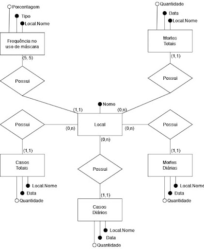

# Projeto COVID-19: Integração de Dados Internacionais para Análise da Pandemia

# Equipe Coviders - CVDRS
* `Fernando dos Reis Santos Filho` - `234471`
* `Renan Hiroki Bastos` - `176573`
* `Vinicius Alves Mancine Dantas` - `188092`

## Resumo do Projeto
O final do ano de 2019 foi marcado pelo surgimento do vírus Sars-CoV-2, responsável pela doença Covid-19 e por uma intensa pandemia com consequências socioeconômicas e sanitárias gravíssimas, graças à sua alta taxa de transmissão. Hoje, quase dois anos depois, grandes bases de dados foram e ainda são construídas ao redor do mundo catalogando os milhões de casos e mortes confirmados por Covid-19 todos os dias.

Durante todo o período de pandemia, recomendações sobre lavar as mãos, evitar aglomeração e utilizar máscara foram fortemente disseminadas. Porém, ao redor do mundo tivemos inúmeros casos de resistência ao uso de máscara, atitude que contribuiu com a alta taxa de transmissão do vírus. Com isso, algumas dúvidas surgiram a respeito de quanto o uso da máscara influencia na disseminação do vírus e se lugares onde o uso de máscara não foi frequente apresentam maiores números de contaminados e mortos por Covid-19.

Logo, nosso objetivo com esse trabalho é extrair, tratar e compilar dados  de fontes distintas relacionados à Covid-19 e a sua prevenção através do uso de máscaras em um único dataset público. Assim, será possível fazer análises sobre a pandemia, a adoção e a eficácia deste método de prevenção em um contexto global através de um único dataset.

## Slides da Apresentação
> Coloque aqui o link para o PDF da apresentação prévia

## Modelo Conceitual Preliminar

> 

## Modelos Lógicos Preliminares

Após a modelagem de nosso modelo conceitual, foram escolhidos dois modelos lógicos para a implementação do banco. Estes têm o objetivo de estruturar os dados de forma lógica, mantendo as relações estabelecidas no modelo conceitual, a fim de armazená-los em um banco de dados. Os modelos escolhidos foram o modelo relacional e o modelo hierárquico.

O modelo relacional, além de ser o modelo mais comum e acessível, foi escolhido por sua representação dos dados em forma de tabelas, que proporciona uma visualização múltipla dos dados e facilita o tratamento e consultas em grandes quantidades de dados.
> Exemplo de modelo lógico relacional
~~~
PESSOA(_Código_, Nome, Telefone)
ARMÁRIO(_Código_, Tamanho, Ocupante)
  Ocupante chave estrangeira -> PESSOA(Código)
~~~

Já o modelo hierárquico foi escolhido por se encaixar na forma em que nossos dados estão estruturados e pela facilidade de se trabalhar, exportar e importar dados estruturados neste modelo.
> 

## Dataset Preliminar a ser Publicado
> Elencar os arquivos/bases preliminares dos datasets serão publicados publicados.

título do arquivo/base | link | breve descrição
----- | ----- | -----
`<título do arquivo/base>` | `<link para arquivo/base>` | `<breve descrição do arquivo/base>`

> Os arquivos finais do dataset publicado devem ser colocados na pasta `data`, em subpasta `processed`. Outros arquivos serão colocados em subpastas conforme seu papel (externo, interim, raw). A diferença entre externo e raw é que o raw é em formato não adaptado para uso. A pasta `raw` é opcional, pois pode ser substituída pelo link para a base original da seção anterior.
> Coloque arquivos que não estejam disponíveis online e sejam acessados pelo notebook. Relacionais (usualmente CSV), XML, JSON e CSV ou triplas para grafos.

## Bases de Dados
> Elencar as bases de dados fonte utilizadas no projeto.

título da base | link | breve descrição
----- | ----- | -----
Coronavirus (Covid-19) Data in the United States | https://github.com/nytimes/covid-19-data | Dados sobre uso de máscara, quantidades de casos e quantidade de mortes por Covid-19 nos Estados Unidos, dividido por estados e cidades.
Data on COVID-19 (coronavirus) by Our World in Data | https://github.com/owid/covid-19-data/tree/master/public/data | Dados sobre quantidade de casos e quantidade de mortes por Covid-19 em 196 países, além de informações sobre vacinação, testes e hospitais em cerca de 200 países.
Personal measures taken to avoid COVID-19 | https://today.yougov.com/topics/international/articles-reports/2020/03/17/personal-measures-taken-avoid-covid-19 | Dados sobre a porcentagem de uso de máscaras em lugares públicos em 23 países em diferentes regiões do mundo.
Mask adherence and rate of COVID-19 across the United States | https://journals.plos.org/plosone/article?id=10.1371/journal.pone.0249891#sec011 | Dados sobre o uso de máscaras, quantidade de casos e quantidade de mortes de Covid-19 em 22 estados dos Estados Unidos.

## Operações realizadas para a construção do dataset

> Coloque um link para o arquivo do notebook, programas ou workflows que executam as operações de construção do dataset:
* extração de dados de fontes não estruturadas como, por exemplo, páginas Web
* agregação de dados fragmentados obtidos a partir de API
* integração de dados de múltiplas fontes
* tratamento de dados
* transformação de dados para facilitar análise e pesquisa

> Se for notebook, ele estará dentro da pasta `notebook`. Se por alguma razão o código não for executável no Jupyter, coloque na pasta `src`. Se as operações envolverem queries executadas atraves de uma interface de um SGBD não executável no Jupyter, como o Cypher, apresente na forma de markdown.

## Perguntas de Pesquisa/Análise Combinadas e Respectivas Análises

> Liste aqui as perguntas de pesquisa/análise e respectivas análises.
> Nem todas as perguntas precisam de queries que as implementam.
> É possível haver perguntas em que a solução é apenas descrita para
> demonstrar o potencial da base.
>
### Pergunta/Análise 1
> * Pergunta 1
>   
>   * Explicação sucinta da análise que será feita ou conjunto de queries que
>     responde à pergunta.

### Pergunta/Análise 2
> * Pergunta 2
>   
>   * Explicação sucinta da análise que será feita ou conjunto de queries que
>     responde à pergunta.

### Pergunta/Análise 3
> * Pergunta 3
>   
>   * Explicação sucinta da análise que será feita ou conjunto de queries que
>     responde à pergunta.

> Coloque um link para o arquivo do notebook que executa o conjunto de queries. Ele estará dentro da pasta `notebook`. Se por alguma razão o código não for executável no Jupyter, coloque na pasta `src`. Se as queries forem executadas atraves de uma interface de um SGBD não executável no Jupyter, como o Cypher, apresente na forma de markdown.
