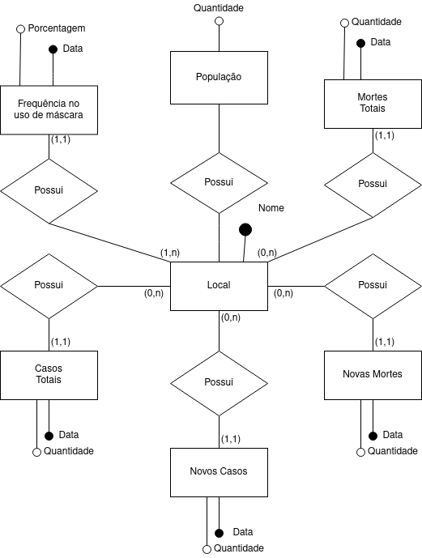
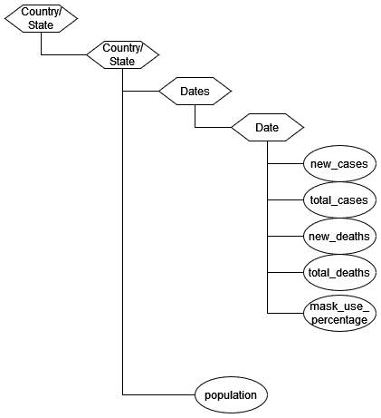

# Projeto COVID-19: Integração de Dados Internacionais para Análise da Pandemia

# Equipe Coviders - CVDRS
* `Fernando dos Reis Santos Filho` - `234471`
* `Renan Hiroki Bastos` - `176573`
* `Vinicius Alves Mancine Dantas` - `188092`

## Resumo do Projeto
O final do ano de 2019 foi marcado pelo surgimento do vírus Sars-CoV-2, responsável pela doença Covid-19 e por uma intensa pandemia com consequências socioeconômicas e sanitárias gravíssimas, graças à sua alta taxa de transmissão. Hoje, quase dois anos depois, grandes bases de dados foram e ainda são construídas ao redor do mundo catalogando os milhões de casos e mortes confirmados por Covid-19 todos os dias.

Durante todo o período de pandemia, recomendações sobre lavar as mãos, evitar aglomeração e utilizar máscara foram fortemente disseminadas. Porém, ao redor do mundo tivemos inúmeros casos de resistência ao uso de máscara, atitude que contribuiu com a alta taxa de transmissão do vírus. Com isso, algumas dúvidas surgiram a respeito de quanto o uso da máscara influencia na disseminação do vírus e se lugares onde o uso de máscara não foi frequente apresentam maiores números de contaminados e mortos por Covid-19.

Logo, nosso objetivo com esse trabalho é extrair, tratar e compilar dados  de fontes distintas relacionados à Covid-19 e a sua prevenção através do uso de máscaras em um único dataset público. Assim, será possível fazer análises sobre a pandemia, a adoção e a eficácia deste método de prevenção em um contexto global através de um único dataset.

## Slides da Apresentação
[slides apresentação](slides/slide_final.pdf)

## Modelo Conceitual Preliminar

> 

## Modelos Lógicos Preliminares

Após a modelagem de nosso modelo conceitual, foram escolhidos dois modelos lógicos para a implementação do banco. Estes têm o objetivo de estruturar os dados de forma lógica, mantendo as relações estabelecidas no modelo conceitual, a fim de armazená-los em um banco de dados. Os modelos escolhidos foram o modelo relacional e o modelo hierárquico.

O modelo relacional, além de ser o modelo mais comum e acessível, foi escolhido por sua representação dos dados em forma de tabelas, que proporciona uma visualização múltipla dos dados e facilita o tratamento e consultas em grandes quantidades de dados.
~~~
CASO(_id_, locations, date, new_cases, total_cases, new_deaths, total_deaths, mask_use_percentage)
~~~

Já o modelo hierárquico foi escolhido por se encaixar na forma em que nossos dados estão estruturados e pela facilidade de se trabalhar, exportar e importar dados estruturados neste modelo.
> 

## Dataset Preliminar a ser Publicado

título do arquivo/base | link | breve descrição
----- | ----- | -----
dados_nyt_tratados.csv  |  | Dados sobre uso de máscara, quantidades de casos e quantidade de mortes por Covid-19 nos Estados Unidos, dividido por estados e cidades.
dados_owid_tratados.csv |  | Dados sobre quantidade de casos e quantidade de mortes por Covid-19 em 196 países, além de informações sobre vacinação, testes e hospitais em cerca de 200 países.
dados_plosone_tratados.csv |  | Dados sobre o uso de máscaras, quantidade de casos e quantidade de mortes de Covid-19 em 22 estados dos Estados Unidos.
eua_final.csv |  | Dados sobre o uso de máscaras, quantidade de casos e quantidade de mortes de Covid-19 em 22 estados dos Estados Unidos.
europa_final.csv |  | Dados sobre o uso de máscaras, quantidade de casos e quantidade de mortes de Covid-19 em 22 estados da Europa.
yougov-tratada - Página1.csv |  | Dados sobre a porcentagem de uso de máscaras em lugares públicos em 23 países em diferentes regiões do mundo.
nyt.csv |  | Dados sobre uso de máscara, quantidades de casos e quantidade de mortes por Covid-19 nos Estados Unidos, dividido por estados e cidades.
owid-covid-data.csv |  | Dados sobre quantidade de casos e quantidade de mortes por Covid-19 em 196 países, além de informações sobre vacinação, testes e hospitais em cerca de 200 países.
plosone.csv |  | Dados sobre o uso de máscaras, quantidade de casos e quantidade de mortes de Covid-19 em 22 estados dos Estados Unidos.
yougov-chart.csv | [raw](data/raw/yougov-chart.csv) | Dados sobre a porcentagem de uso de máscaras em lugares públicos em 23 países em diferentes regiões do mundo.

## Bases de Dados

título da base | link | breve descrição
----- | ----- | -----
Coronavirus (Covid-19) Data in the United States | https://github.com/nytimes/covid-19-data | Dados sobre uso de máscara, quantidades de casos e quantidade de mortes por Covid-19 nos Estados Unidos, dividido por estados e cidades.
Data on COVID-19 (coronavirus) by Our World in Data | https://github.com/owid/covid-19-data/tree/master/public/data | Dados sobre quantidade de casos e quantidade de mortes por Covid-19 em 196 países, além de informações sobre vacinação, testes e hospitais em cerca de 200 países.
Personal measures taken to avoid COVID-19 | https://today.yougov.com/topics/international/articles-reports/2020/03/17/personal-measures-taken-avoid-covid-19 | Dados sobre a porcentagem de uso de máscaras em lugares públicos em 23 países em diferentes regiões do mundo.
Mask adherence and rate of COVID-19 across the United States | https://journals.plos.org/plosone/article?id=10.1371/journal.pone.0249891#sec011 | Dados sobre o uso de máscaras, quantidade de casos e quantidade de mortes de Covid-19 em 22 estados dos Estados Unidos.

## Operações realizadas para a construção do dataset

Tendo as fontes dos dados necessários, foram utilizadas técnicas de extração, integração de dados de múltiplas fontes e o tratamento dos dados para implementação e padronização do banco de acordo com os modelos já discutidos.  Para os dados extraídos da “Our World in Data” foi necessária a remoção dos países não incluídos nas pesquisas sobre máscaras, remoção das colunas irrelevantes para nossa análise e compilação dos casos diários de contaminação por COVID-19 em dados mensais. Já para os dados da YouGov, foi realizado uma média por mês de todas as coletas sobre a porcentagem do uso de máscara naquele país, além da remoção das células onde o somatório foi 0, ou seja, não houve nenhuma coleta de dados sobre o uso de máscaras naquele mês.

A sequência de operações realizadas sobre o conjunto de dados para a contrução do dataset pode ser encontrada [neste notebook.](notebooks/Notebook_Trabalho_Final.ipynb)

## Perguntas de Pesquisa/Análise Combinadas e Respectivas Análises

>  Aqui seguem algumas perguntas de pesquisa/análise descritas para
> demonstrar o potencial da base.
>
### Pergunta/Análise 1
 * Os locais com maior número de casos são também os lugares com menor índice de uso de máscaras?
 ~~~
SELECT sum(new_cases),
       avg(new_cases)
FROM Tabela_final,
WHERE mask_use_percentage < 25;

SELECT sum(new_cases),
       avg(new_cases)
FROM Tabela_final,
WHERE mask_use_percentage >= 25 AND mask_use_percentage < 50;

SELECT sum(new_cases),
       avg(new_cases)
FROM Tabela_final,
WHERE mask_use_percentage >= 50 AND mask_use_percentage < 75; 

SELECT sum(new_cases),
       avg(new_cases)
FROM Tabela_final,
WHERE mask_use_percentage >= 75;
 ~~~

### Pergunta/Análise 2
 * Quais são os locais com maior número de casos por índice de uso de máscaras?
  ~~~
SELECT location,
	   date,
	   mask_use_percentage,
	   new_cases,
	   new_cases/mask_use_percentage as case_mask_rate
FROM tabela_final
WHERE mask_use_percentage > 0 AND new_cases > 0
ORDER BY case_mask_rate DESC
LIMIT 20;
 ~~~
 

### Pergunta/Análise 3
 * Há algum indício de que a frequência de uso de máscara influência na taxa de mortalidade?
  ~~~
SELECT  location,
        date,
        mask_use_percentage,
        new_deaths/new_cases as monthly_death_rate,
        total_deaths/total_cases as overall_death_rate
FROM tabela_final
ORDER BY mask_use_percentage, monthly_death_rate;
 ~~~
 
### Pergunta/Análise 4
 * Locais na mesma faixa de porcentagem de uso de máscara possuem taxas de infecções parecidas?
  ~~~
SELECT location,
       new_cases
FROM Tabela_final,
WHERE mask_use_percentage < 10;

SELECT location,
       new_cases
FROM Tabela_final,
WHERE mask_use_percentage >= 10 AND mask_user_percentage < 20;

SELECT location,
       new_cases
FROM Tabela_final,
WHERE mask_use_percentage >= 20 AND mask_user_percentage < 30;

SELECT location,
       new_cases
FROM Tabela_final,
WHERE mask_use_percentage >= 30 AND mask_user_percentage < 40;

SELECT location,
       new_cases
FROM Tabela_final,
WHERE mask_use_percentage >= 40 AND mask_user_percentage < 50;

SELECT location,
       new_cases
FROM Tabela_final,
WHERE mask_use_percentage >= 50 AND mask_user_percentage < 60;

SELECT location,
       new_cases
FROM Tabela_final,
WHERE mask_use_percentage >= 60 AND mask_user_percentage < 70;
SELECT location,
       new_cases
FROM Tabela_final,
WHERE mask_use_percentage >= 70 AND mask_user_percentage < 80;

SELECT location,
       new_cases
FROM Tabela_final,
WHERE mask_use_percentage >= 80 AND mask_user_percentage < 90;

SELECT location,
       new_cases
FROM Tabela_final,
WHERE mask_use_percentage >= 90;
 ~~~

### Pergunta/Análise 5
 * A proporção mortes/casos é influênciada pela frequência no uso de máscara?
  ~~~
SELECT avg(new_deaths*100/new_cases) as avarage_death_rate
FROM Tabela_final
WHERE mask_use_percentage < 25;

SELECT avg(new_deaths*100/new_cases) as avarage_death_rate
FROM Tabela_final
WHERE mask_use_percentage >= 25 AND mask_use_percentage < 50;

SELECT avg(new_deaths*100/new_cases) as avarage_death_rate
FROM Tabela_final
WHERE mask_use_percentage >= 50 AND mask_use_percentage < 75; 

SELECT avg(new_deaths*100/new_cases) as avarage_death_rate
FROM Tabela_final
WHERE mask_use_percentage >= 75;
 ~~~
